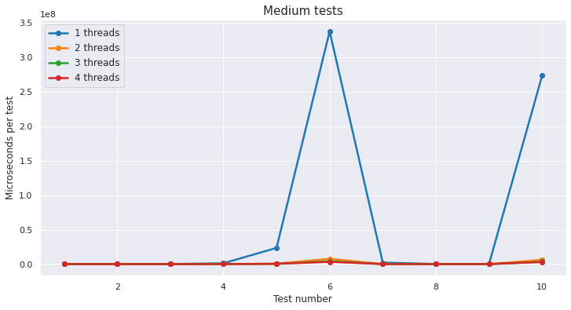
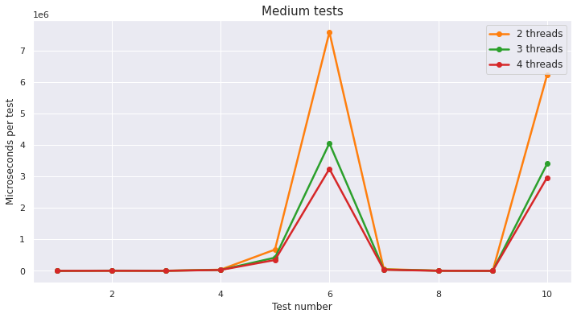
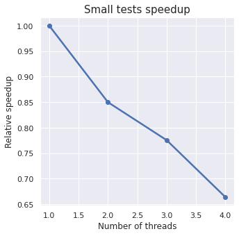
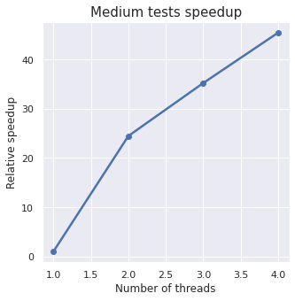

# Knapsack

## Problem
Problem statement can be found [here](problem.pdf) (English version is not available at the time of writing).

## Algorithm
The main idea is, of course, branch and bound method. Algorithm proceeds by repeatedly partitioning the class
of all feasible solutions into smaller and smaller subclasses in such a way that
ultimately an optimal solution is obtained.  For each of the subclasses of solutions one computes an
upper bound to the maximum value attained by solutions belonging to the subclass. 

On the basis of these upper bounds, a further stage of branching is carried out, new upper bounds are computed, and
so on, repeatedly, until ultimately a feasible solution is obtained which has a value
greater than the upper bounds of all the subclasses and
also higher than the values of all previously obtained
solutions. 

The algorithm is constructive in nature. It repeats the branching
process, successively generating smaller and smaller subclasses some of which
ultimately will contain only one feasible solution, one of which will be optimal. 

## Implementation details
* Algorithm uses thread pool to which one posts new `Tasks` for `workers` to execute. 
* Each `Task` consists of some number of `States` (or nodes, in terms of b&b method) for `worker` to check. 
* `States` are sorted in decreasing order with respect to possible bound.
* Source code is located in [`src`](src) directory.

## Benchmarks
Measurements were taken on 3,1 GHz Dual-Core Intel Core i5 (2 cores, 4 threads with hyper-threading enabled)
in [`Release`](https://cmake.org/cmake/help/v3.18/variable/CMAKE_BUILD_TYPE.html) build
after ensuring that ThreadSanitizer reported no errors and turning it off.

* The algorithm performs rather uniform on small tests no matter how many threads are running.
  
  
  
* However, there is a remarkable difference for medium tests. 
  As can be seen below, single thread requires too much time on tests 6 and 10
  to be compared against multithreaded runs.
  
  

* For clarity, here is the same plot as above but without single thread measurements.
  
  

* Relative *mean* speedups for each group of tests is shown below.  
  Keep in mind that benchmarks for small tests don't differ much in absolute values.
  
   

## References
* https://www0.gsb.columbia.edu/mygsb/faculty/research/pubfiles/4407/kolesar_branch_bound.pdf

## Appendix
Contact the author if Jupyter notebooks with code for plots are needed.
